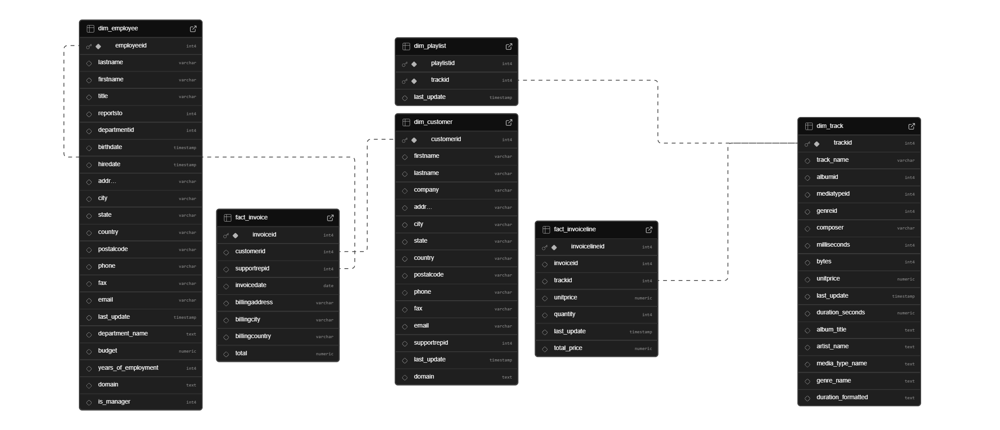

# Music-Store-DWH-Analysis
📊 Music Store Data Warehouse & Business Intelligence

פרויקט זה מדגים בניית מחסן נתונים (DWH) מקצה לקצה ב-PostgreSQL, הכולל תהליכי ETL, הגדרת קשרי גומלין (Constraints) וביצוע שאילתות ניתוח עסקי מורכבות.

## 🏗️ Database Architecture (ERD)
כדי להמחיש את מבנה מחסן הנתונים, יצרתי תרשים ERD המציג את הקשרים בין טבלאות הממד (Dimensions) לטבלאות העובדות (Facts):

💿 Dimensions (טבלאות ממד)
Dim_Track

תיאור: ישות אחת "רחבה" הכוללת את כל המידע על השיר.   

לוגיקה: דה-נורמליזציה של ז'אנרים, אמנים ואלבומים. שינוי שמות עמודות (track_name, artist_name) לבהירות וחישוב משך שיר בפורמט קריא (MM:SS) .   

Dim_Customer

תיאור: נתוני לקוחות מנוקים ומעושרים.   

לוגיקה: האחדת פורמט שמות (Capitalization) באמצעות INITCAP וחילוץ דומיין האימייל לניתוח שיווקי.   

Dim_Employee

תיאור: נתוני עובדים והיררכיה ארגונית.   

לוגיקה: העשרת נתונים עם תקציב מחלקתי , חישוב ותק בשנים והגדרת דגל is_manager לזיהוי מנהלים בארגון.   

Dim_Playlist

תיאור: מיפוי שירים לרשימות השמעה.   

לוגיקה: חיבור בין קוד הפלייליסט לשמו הטקסטואלי לצורך דוחות.   

💰 Facts (טבלאות עובדות)
Fact_Invoice

תיאור: תיעוד עסקאות ברמת המאקרו (ראש הזמנה).   

קשרים: הגדרת מפתחות זרים (FK) ללקוחות ולטבלת המטבעות לצורך המרות שער.   

Fact_InvoiceLine

תיאור: פירוט הפריטים שנרכשו בכל הזמנה (Granularity ברמת השיר). 

🔍 Key Business Insights (SQL Analysis)

הפרויקט עונה על שאלות עסקיות קריטיות באמצעות SQL מתקדם (CTEs, Window Functions):

ניתוח צמיחה: חישוב אחוזי גדילה בהכנסות של עובדים משנה לשנה באמצעות LAG.   

פילוח מדינות: זיהוי 5 המדינות המובילות בהכנסות תוך המרת מטבע לשקל (ILS).   

ביצועי מוצרים: סיווג שירים לפי נפח מכירות (0, 1-5, 6-10, 10+).

לוגיקה: חישוב אוטומטי של מחיר סופי לכל שורה (total_price).

📈 Conclusions & Business Insights
לאחר בניית המודל והרצת שאילתות ה-BI, להלן הממצאים העיקריים מהניתוח:

🌍 ניתוח שווקים גלובלי (Market Performance)

ריכוזיות הכנסות: זוהו 5 המדינות המובילות (Top 5) המניבות את מירב ההכנסות לחנות במונחי שקלים (ILS), מה שמאפשר להנהלה למקד תקציבי שיווק בשווקים אלו.   

אסטרטגיית "Other": המודל זיהה כי קיימות מדינות רבות עם לקוח יחיד.

אלו קובצו תחת הקטגוריה "Other" כדי לקבל תמונה ברורה יותר של ממוצע ההזמנות וההכנסה ללקוח בשווקים המרכזיים.

🎵 פופולריות מוצרים וז'אנרים

ניתוח "זנב ארוך": פילוח השירים לפי נפח מכירות (Sales Buckets) חשף אילו שירים הם "רבי-מכר" (10+ מכירות) ואילו שירים אינם נמכרים כלל, מה שמאפשר אופטימיזציה של קטלוג המוצרים

העדפות מקומיות: הניתוח הראה שז'אנרים מסוימים דומיננטיים יותר במדינות ספציפיות (למשל, אחוז המכירות של רוק לעומת ג'אז במדינות שונות), מה שמאפשר התאמת פלייליסטים מבוססת מיקום גיאוגרפי.

👥 ביצועי כוח אדם (Sales Workforce)

צמיחה שנתית: באמצעות שימוש בפונקציות חלון  המודל חישב את אחוז הצמיחה השנתי של כל עובד.
נמצא כי עובדים ותיקים (Years of Seniority) אינם בהכרח אלו עם אחוז הצמיחה הגבוה ביותר, מה שמרמז על פוטנציאל גבוה בקרב עובדים חדשים.

אפקטיביות שירות: המודל חישב את כמות הלקוחות הייחודיים המטופלים על ידי כל איש שירות, נתון שעוזר באיזון עומסים בצוות.

🛠️ Technical Implementation Summary

הפרויקט מדגים יכולות בניהול נתונים (Data Engineering) הכוללות:

Star Schema: בניית מודל נתונים המורכב מטבלאות ממד (Dimensions) וטבלאות עובדות (Facts) לשיפור ביצועי שליפה.

ETL & Cleaning: טיוב נתונים (Data Cleansing) 

הכולל האחדת שמות, חילוץ דומיינים מכתובות מייל וחישוב עמודות נגזרות (כמו ותק עובדים)

Data Integrity: אכיפת קשרי גומלין ומפתחות (PK/FK) להבטחת שלמות הנתונים ומניעת יתירות.
